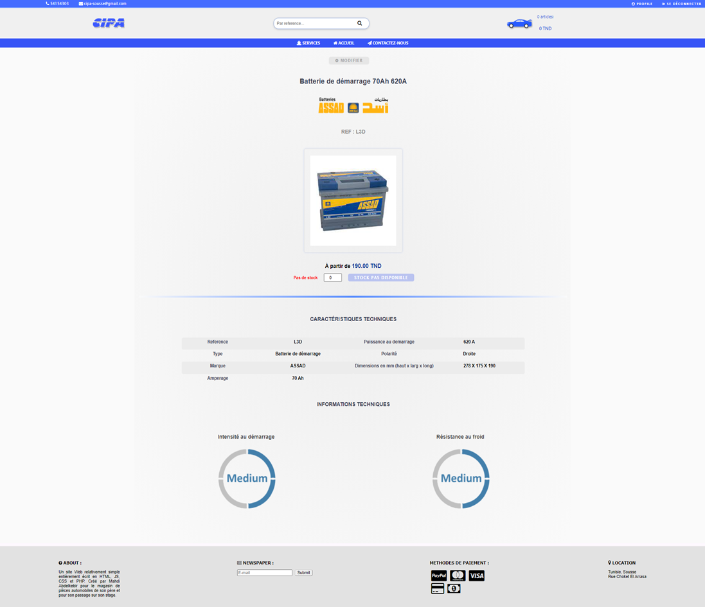
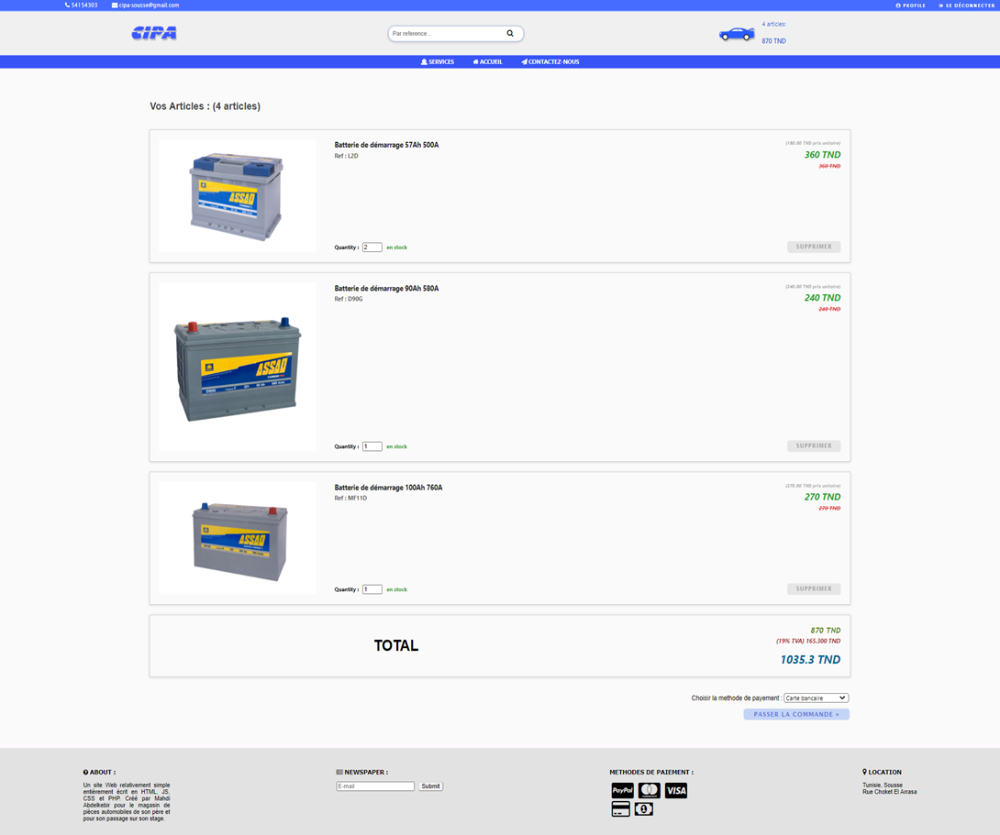

# ecommerce_toolshop_php

My first actual website, meant to sell products online for my father's shop.

It was good at that time, and now, although it still looks, not only did I lose the database SQL file, this website also lacks severely in security without query preparation or form validation or anything.

<table cellpadding="0">
  <tr style="padding: 0">
    <!-- GitHub Stats Card -->  
    <td valign="top">
         
    </td>
    <td valign="top">
         
     </td>
  </tr>
  </tr>
       <td valign="top">
         
     </td>
      <td valign="top">
         
     </td>
  </tr>
</table>

